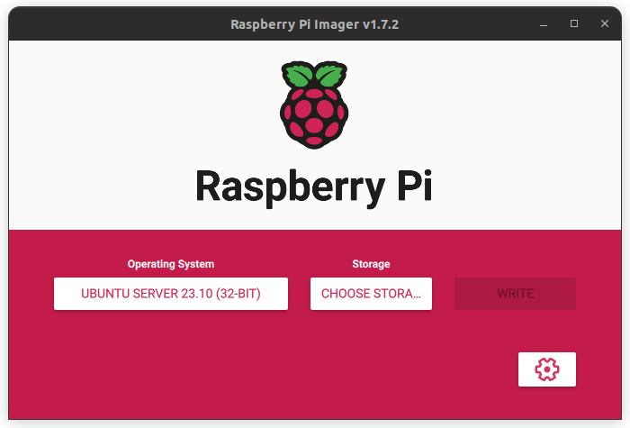

# Configure a Rasbry Pi with [Ansible](https://www.ansible.com/)

In this readme all the procedure to configure and install base software on a Raspberry Pi with Ansible

---

## Summary

[TOC]

## Install os

To install the OS on your SD card, use Raspberry Pi Imager : `sudo apt install rpi-imager` or [download it](https://www.raspberrypi.com/software/)

Choose your operating system and your SD card

There are many different OS to install on your Raspberry. Here's a small sample:

-   Raspberry Pi OS (64-bit)
-   Raspberry Pi OS (32-bit)
-   Ubuntu Desktop 23.10 (64-bit)
-   Ubuntu Server 23.10 (64-bit)
-   Apertis
-   RISC OS (5.28)
-   ...

We'll use Ubuntu Server
